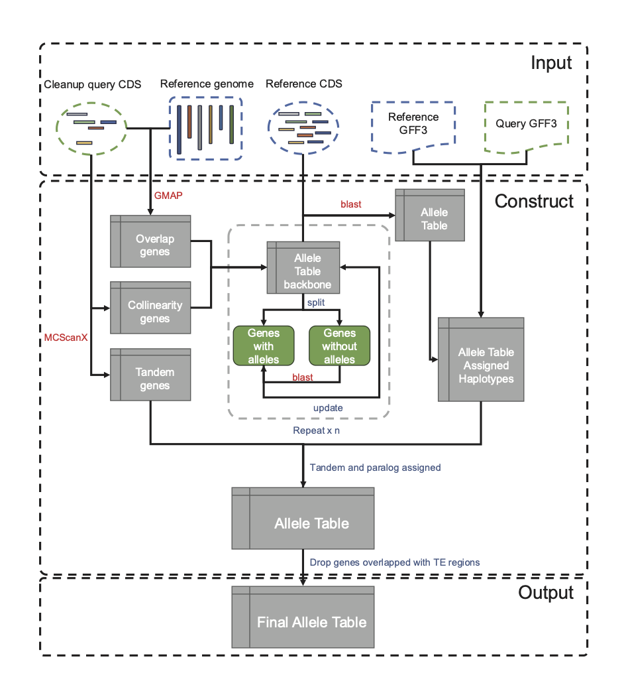

# AlleleFinder: a tool for identifying allele genes from polyploid genome.

[](https://doi.org/10.5281/zenodo.14015588)
## Introduction

This software is used for identifying allele genes from polyploid genome.

## Overview



## Dependencies

Software:

- [MCScanX](https://github.com/wyp1125/MCScanX)
- [GMAP](http://research-pub.gene.com/gmap/)
- [NCBI BLAST+](https://ftp.ncbi.nlm.nih.gov/blast/executables/blast+/LATEST/)

> **Notice:** these software should be added to the <kbd>PATH</kbd> Environment Variable.

## Installation

```bash
cd /path/to/install
git clone https://github.com/sc-zhang/AlleleFinder.git
chmod +x AlleleFinder/allelefinder.py
# Optional
echo 'export PATH=/path/to/install/AlleleFinder:$PATH' >> ~/.bash_profile
source ~/.bash_profile
```

## Usage

### 1. main program

```bash
usage: allelefinder.py [-h] {prepare,construct,stat,adjust} ...

options:
  -h, --help            show this help message and exit

Sub commands:
  {prepare,construct,stat,adjust}
    prepare             Remove same CDS from cds, pep and gff3 files
    construct           Construct allele table
    stat                Statistic allele table
    adjust              Adjust allele table with too many genes be marked as paralog
```

### 2. prepare data

If the genes with same CDS sequence, the "prepare" would deal with them and only one gene would be kept randomly.

```bash
usage: allelefinder.py prepare [-h] --in_cds IN_CDS [--in_pep IN_PEP] --in_gff3 IN_GFF3 --out_cds OUT_CDS [--out_pep OUT_PEP] --out_gff3 OUT_GFF3

options:
  -h, --help           show this help message and exit
  --in_cds IN_CDS      Input CDS file
  --in_pep IN_PEP      Input PEP file
  --in_gff3 IN_GFF3    Input GFF3 file
  --out_cds OUT_CDS    Output CDS file
  --out_pep OUT_PEP    Output PEP file
  --out_gff3 OUT_GFF3  Output GFF3 file
```

> **Notice:** CDS file and GFF3 file are required, PEP file is optional.

### 3. construct allele table

#### Usage

```bash
usage: allelefinder.py construct [-h] -r REF -d REF_CDS -f REF_GFF3 -c CDS -g GFF3 -n NUM_ALLELE [-m] [-b BLAST_COUNT] [-i BLAST_IDENTITY] [-e TE] [-j TE_OVERLAP] [--paralog_only] [-w WORKDIR] [-t THREADS]

options:
  -h, --help            show this help message and exit
  -r REF, --ref REF     reference fasta
  -d REF_CDS, --ref_cds REF_CDS
                        CDS fasta of ref
  -f REF_GFF3, --ref_gff3 REF_GFF3
                        GFF3 file of ref
  -c CDS, --cds CDS     CDS fasta of polyploid
  -g GFF3, --gff3 GFF3  GFF3 file of polyploid
  -n NUM_ALLELE, --num_allele NUM_ALLELE
                        number of allele
  -m, --is_mono         if your reference fasta is mono assembly of polyploid, add this argument
  -b BLAST_COUNT, --blast_count BLAST_COUNT
                        blast count, default: 2
  -i BLAST_IDENTITY, --blast_identity BLAST_IDENTITY
                        threshold of blast identity, default: 80
  -e TE, --TE TE        TE gff3 for filtering, default: ""
  -j TE_OVERLAP, --TE_overlap TE_OVERLAP
                        threshold of TE overlap, default: 0.3, only effect when TE is not NULL
  --paralog_only        do TE filter only on paralog genes
  -w WORKDIR, --workdir WORKDIR
                        workdir, default: wrkdir
  -t THREADS, --threads THREADS
                        threads, default: 12
```

> **Notice:**
> 1. the name of Chromosomes should be like: Chr01X, "X" means consecutive uppercase letters from A to Z, indicates
     different alleles, for example, if there are 4 alleles, the names should be: Chr01A,Chr01B,Chr01C,Chr01D.
> 2. the gff3 files must contain "gene" records, or you can use "sed" command to change "mRNA" to "gene" for some
     downloaded gff3 files.
> 3. there must no '-' in gene id.

#### Results

1. **Without TE filter**

   **allele.adjusted.txt** is the file contain all allele genes

   **allele.adjusted.*.stat** are the statistics information of allele

2. **With TE filter**

   **allele.adjusted.nonTEs.txt** is the file contain all allele genes

   **allele.adjusted.nonTEs.*.stat** are the statistics information of allele

### 3. Statistic

```bash
usage: allelefinder.py stat [-h] -i INPUT -g GFF3 -o OUTPUT

options:
  -h, --help            show this help message and exit
  -i INPUT, --input INPUT
                        Input allele table
  -g GFF3, --gff3 GFF3  GFF3 file of polyploid
  -o OUTPUT, --output OUTPUT
                        Prefix of output file
```

### 4. Additional

If there are too many genes be marked with paralog, you can use command below to pull them down as new alleles

```bash
usage: allelefinder.py adjust [-h] -i INPUT -m MIN_NUM -o OUTPUT

options:
  -h, --help            show this help message and exit
  -i INPUT, --input INPUT
                        Input allele table
  -m MIN_NUM, --min_num MIN_NUM
                        Minium number of genes, which means the number of genes marked as paralog that distribute in different allele should be pulled down as new allele genes
  -o OUTPUT, --output OUTPUT
                        Output allele table
```
